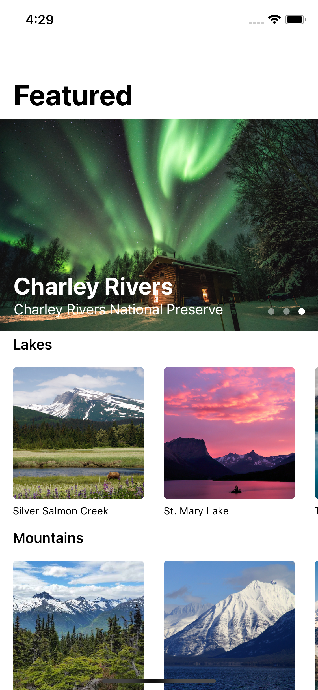
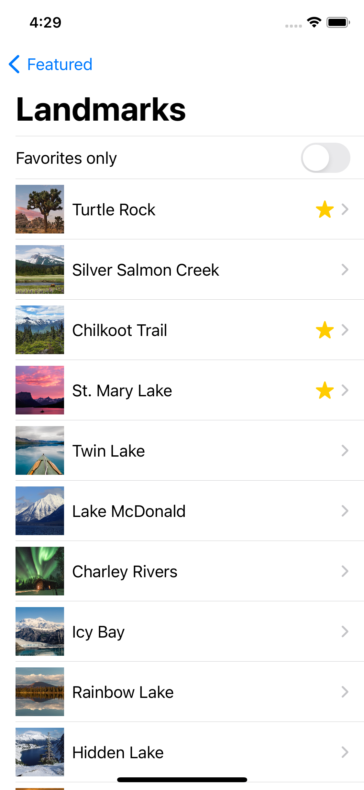

## 介绍

SwiftUI-Tutorial是基于Swift的语言面向未来的声明式语法编程框架。
该项目持续更新并使用最新的语法。

### 目录

- [官方教程](#官方教程)
- [文章](#文章)

## 官方教程

跟随Apple最新的官方文档上的SwiftUI教程。抽取中关于属性修饰器、容器视图、集成UIKit的重要基础章节，没有引入绘制与动画、watchOS和macos跨平台章节。

-[官方教程]()

## 文章

- [App协议]()
- [Some关键字]()