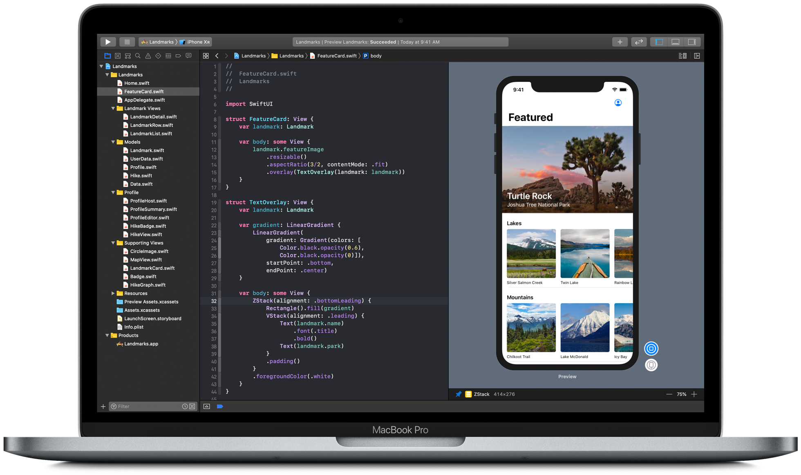

## 介绍

SwiftUI-Tutorial是基于Swift的语言面向未来的声明式语法编程框架。
该项目持续更新并使用最新的语法。

### 目录

- [官方教程](#官方教程)
- [文章](#文章)
    - [App协议](#App协议)
    - [Some关键字](#Some关键字)
    - [布局系统](#布局系统)

## 官方教程

跟随Apple最新的官方文档上的SwiftUI教程。抽取中关于属性修饰器、容器视图、集成UIKit的重要基础章节，没有引入绘制与动画、watchOS和macos跨平台章节。

- [官方教程](https://github.com/ChinaWxq/SwiftUI-Tutorial/tree/master/Apple-SwiftUI-Tutorial)

## 文章

- [App协议](https://github.com/ChinaWxq/SwiftUI-Tutorial/tree/master/App%20Protocol)
- [Some关键字](https://github.com/ChinaWxq/SwiftUI-Tutorial/tree/master/Some)
- [布局系统](https://github.com/ChinaWxq/SwiftUI-Tutorial/tree/master/Layout%20System)